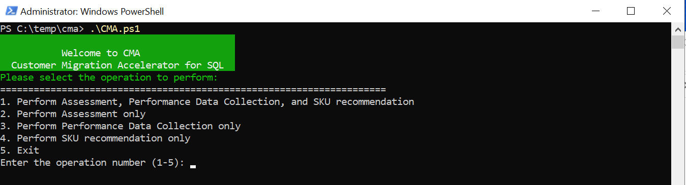
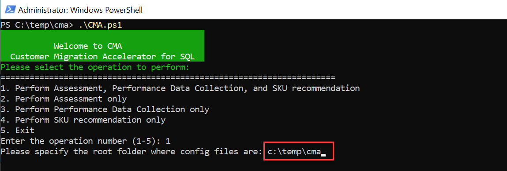
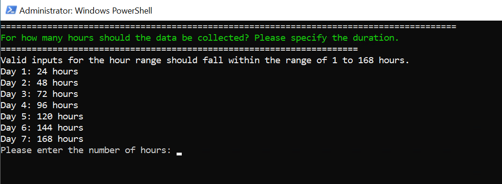
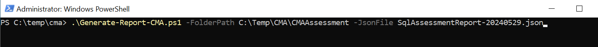

# CMA Toolbox

Welcome to the CMA Toolbox!

The Customer Migration Accelerator (CMA) Toolbox is designed to accelerate your SQL Server assessment, data collection, and SKU recommendation processes at scale. With automated workflows and comprehensive reporting, the CMA Toolbox simplifies complex tasks, providing clear insights and actionable recommendations.

## Features

- **Automated SQL Server Assessment**: Run comprehensive assessments of your SQL Server instances to identify potential migration issues and opportunities.
- **Automated SQL Server data collection**: Collect data of comprehensive of your SQL Server instances to identify the right SKU.
- **Automated SQL Server SKU recommendation**: Get comprehensive SKU recommendation of your SQL Server instances to identify the right Azure SQL target.
- **Excel Report Generation**: Automatically generate detailed Excel reports that summarize findings, recommendations, and key metrics.
- **Scalability**: Designed to handle multiple SQL Server instances efficiently.

## How It Works

1. **Assessment**: The toolbox assess your SQL Server instances using a json config file.
2. **Data Collection**: The toolbox collects data from your SQL Server instances using a json config file.
3. **SKU recommendation**: Recommendation is generated to *Azure SQL VM, Azure SQL Database and Azure SQL Mananged Instance*. An additional file is generate where the SKU recommendations for all three target platforms will be evaluated, and the best fit will be returned.
4. **Report Generation**: Generate Excel reports summarizing the findings, which can be used to plan your migration strategy.

## Getting Started

### Prerequisites

- SQL Server instances to assess.
- PowerShell environment for running scripts.
- Excel software for viewing reports.

1. Create a Folder
   - Create a folder named CMA in C:\temp. Your final path should be C:\temp\CMA.
   - You can create the folder in a different location, but this will require additional changes in the JSON files.
2. Modify JSON Files

   - There are two JSON files that need to be modified:
     - configAssessment.json

       - This template JSON file is intended to help you. Replace all the connection strings with those of your SQL Server instances. Use Windows Authentication whenever possible.
       - If you've created a folder in a different location, change the outputFolder parameter accordingly.
       > [!NOTE]
       > The CMAAssessment folder will be created automatically based on your specified location.

    ```json
    {
        "action": "Assess",
        "outputFolder": "C:\\temp\\CMA\\CMAAssessment",
        "overwrite":  "True",
        "sqlConnectionStrings": [
            "Data Source=Server1.database.net;Initial Catalog=master;Integrated Security=True;Encrypt=True;TrustServerCertificate=True",
            "Data Source=Server2.database.net;Initial Catalog=master;Integrated Security=True;Encrypt=True;TrustServerCertificate=True",
            "Data Source=Server3.database.net;Initial Catalog=master;User ID=sqluser;Password=password@123;Encrypt=True;TrustServerCertificate=True",
            "Data Source=Server4.database.net;Initial Catalog=master;User ID=sqluser;Password=password@123;Encrypt=True;TrustServerCertificate=True"
        ]
    }
    ```

     - configPerformanceDataCollect.json

       - This template JSON file is also intended to help you. Replace all the connection strings with those of your SQL Server instances. Use Windows Authentication whenever possible.
       - If you've created a folder in a different location, change the outputFolder parameter accordingly.
       > [!NOTE]
        > The CMADataCollection folder will be created automatically based on your specified location.

    ```json
    {
        "action": "PerfDataCollection",
        "outputFolder": "C:\\temp\\CMA\\CMADataCollection",
        "perfQueryIntervalInSec": 20,
        "staticQueryIntervalInSec": 120,
        "numberOfIterations": 7,
        "sqlConnectionStrings": [
            "Data Source=Server1.database.net;Initial Catalog=master;Integrated Security=True;Encrypt=True;TrustServerCertificate=True",
            "Data Source=Server2.database.net;Initial Catalog=master;Integrated Security=True;Encrypt=True;TrustServerCertificate=True",
            "Data Source=Server3.database.net;Initial Catalog=master;User ID=sqluser;Password=password@123;Encrypt=True;TrustServerCertificate=True",
            "Data Source=Server4.database.net;Initial Catalog=master;User ID=sqluser;Password=password@123;Encrypt=True;TrustServerCertificate=True"
         ]
    }
    ```

### Running the CMA script

This script is designed to run on your local machine, not on the server. You must ensure connectivity between your local machine and the SQL Server instances, as well as internet connectivity.

- Open PowerShell with administrative privileges.
- Navigate to the folder where the CMA script is located and then run the script.


- Choose your operation and then input the folder location for the config files.


- if you choose to collect data, you must specify how long you want to collect data


> [!IMPORTANT]
> Currently, the script can only handle time inputs in hours, not minutes.

> [!TIP]
> If you want to test the script, you can uncomment the following block in the CMA_PerformanceDataCollect function. Note that duration is in seconds and 5 minutes is the minimum amount of time required to generate the SKU recommendation.

```powershell

        $debug = $false
        if (!$debug) { 
            $duration = 300 
        }
```

From this point, the script will start running and will handle any prerequisite software or PowerShell modules needed to complete the assessment.

If you need to run this script on a machine without internet connectivity, you must install the following prerequisites manually:

- [.NET 6.0 SDK](https://dotnet.microsoft.com/en-us/download/dotnet/6.0)
- [Az.DataMigration](https://learn.microsoft.com/en-us/powershell/module/az.datamigration/?view=azps-11.6.0)
- [Az.Accounts](https://learn.microsoft.com/en-us/powershell/module/az.accounts/?view=azps-11.6.0)

### Generating the Excel report for assessment

After assessing your SQL Server instances, a JSON file is generated. To create the report, you need to run the [Generate-Report-CMA.ps1](./scripts/Generate-Report-CMA.ps1) script."

This script takes 2 parameters:

- FolderPath
- JsonFile



***The Excel report is generated in the same folder where the JSON file resides***

## Contributing

We welcome contributions to improve the CMA Toolbox. If you have suggestions or encounter issues, please open an issue or submit a pull request.

## License

This project is licensed under the MIT License. See the [LICENSE](LICENSE) file for details.
